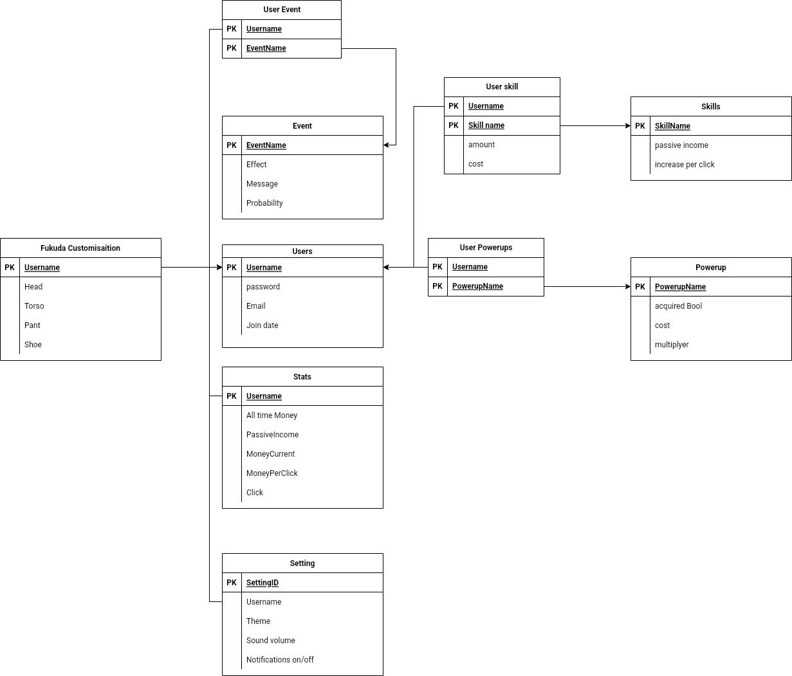

# Fukuda_project
CSS326 Database Lab project.
## Game Design

- Tap to increase money

- Buy skill to increase passive income and increase money per click

- Buy powerup from store to increase skills power (twice..)

- Click to a threshold cps for some second to get powered (autoclick 2x) on random cooldown (Events)

- Use money to buy Fukuda customization

## Tables 
- User (username, password)
- Skill( skill upgrade list)
- Store (power up list)
- Stats
- Fukuda Customization
- Setting
- Events

EERD(link : https://drive.google.com/file/d/1qOWuVpo94jOJCajYtX2wI9oSJOAr3NXi/view?usp=sharing )

## Rules:
- Each user can buy many skills. Each skill can be bought by many users
- Each user can buy many powerups. Each powerups can be bought by many users.
- Each user can customize a Fukuda Customisation. Each Fukuda Customisation can be customized by only one user.
- Each user has a stat. Each stat is owned by a user.
- Each power up affected a skill. A skill may be affected by powerups.
- Each User has a setting. Each setting belongs to a user.
- Each user can encounter many events. Each events can happen to many users.

## User Journey (Patt)
- User เจอ Login Page
- User register
- User enter login page
- User enter game page
- User click fukuda to increase money
- User buy skill to increase passive income and increase money per click
- User buy powerup from store to increase skills power 
- User encounter an event
- User click on customisation button
- User change Fukuda appearance by click arrow button
- User close customisation page
- User click on setting
- User change setting
- User close setting
- User click on stats
- User read stats
- User close stats

## User Interface(Pon)

## Database Design (Gus, Patt)

^this is ERD for project database
## Slide()
